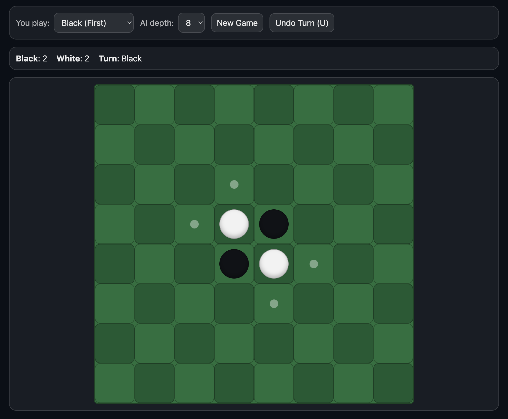

# Othello AI Demo

Demo: <https://othello.isaacsalzman.com/>

Interactive Othello/Reversi web demo using Rust + WebAssembly for AI logic and JavaScript/HTML/CSS for UI.



- Minimax + alpha-beta pruning
- Weighted board evaluation
- Endgame search switch for stronger late-game response
- Depth controls, side selection, and undo

## Run Locally

### 1) Rebuild Wasm (after Rust changes)

```bash
npm run build:wasm
```

### 2) Serve as static site

From the project root:

```bash
python3 -m http.server 8080
```

Open:

```text
http://localhost:8080
```
